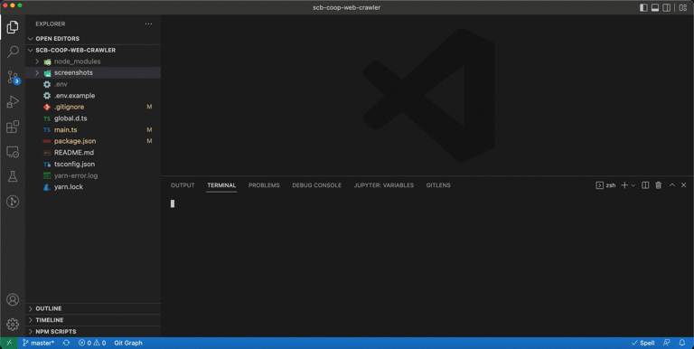

# SCB COOP NET BOT

## Motivation

I'm too lazy to login to the website of [SCB CO-OP](https://scbcoop.scb.co.th/) and view my assets.
So I created this bot to do that by using [puppeteer](https://github.com/puppeteer/puppeteer) to login and capture the screenshot of the page and save to the [screenshots](./screenshots/) folder.

Intentionally, I want this project to crawl all the details and returns JSON result only, not screenshot the entire page.

Unfortunately, the parsing process of the webpage is taking too much time. Therefore the screenshot comes in place.

I'd appreciated the pull request from the visitors. 👀

Also, you can take a look what else you can contribute at the [Todo List](#todo-list) section.

## Demo



## Requirement

- An account in the [SCB CO-OP](https://scbcoop.scb.co.th/) website.
- Node v16

## Installation

Install all of the dependencies via

```bash
$ npm install
# or
$ yarn install
```

## Setup the username and password

Copy `.env.example` to a new file called `.env` and update your username and password of the [SCB CO-OP](https://scbcoop.scb.co.th/) website.

## Run the script

```bash
$ yarn dev
```

## The result

Simply just look at the [screenshots](./screenshots) folder then you will find the list of screenshots, including

- Share stock page
- Deposit page

## Todo List
- [x] More readable documents, how to install program, runs, starts
- [x] Capture a screenshot from deposit page
- [ ] To be a real web crawler, not screenshot
- [ ] Unit testing with Jest
